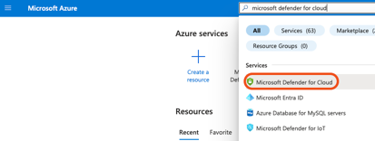
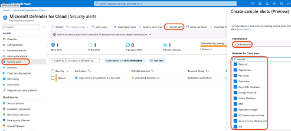
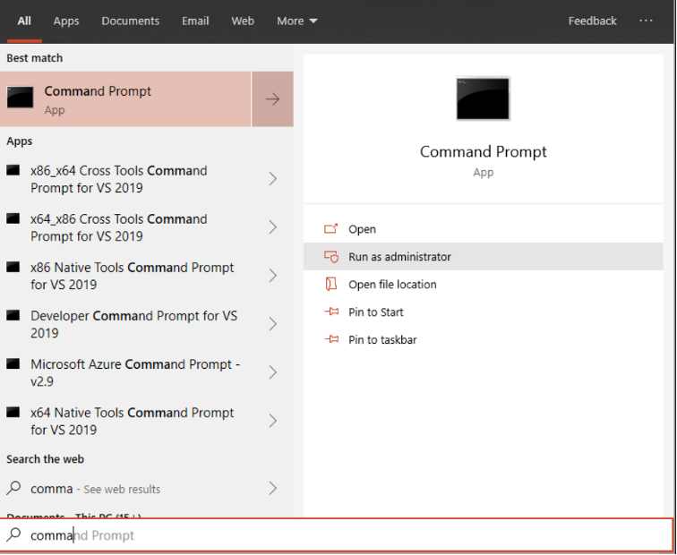

## Generate sample security alerts

### Table of Contents

- [Introduction](#introduction)

- [What is sample security alert?](#what-is-sample-security-alert)

- [Prerequisites](#prerequisites)

- [Generate Sample Security Alerts from: ](#generate-sample-security-alerts-from)

    - [Microsoft Defender for Cloud](#microsoft-defender-for-cloud)

    - [Azure VMs (Windows)](#azure-vms-windows)

    - [Azure VMs (Windows) - PowerShell script in fileless attack](#azure-vms-windows---powershell-script-in-fileless-attack)

    - [Azure VMs (Linux)](#azure-vms-linux) 

- [Complete Documentation:](#complete-documentation)

## Introduction

As part of ensuring that the necessary integrations and responses are correctly configured, it is often useful to generate sample security alerts. This allows NHS Trusts to validate that their systems and processes respond as expected without waiting for a real threat. This document outlines the steps to generate these sample alerts in Azure, based on information from Microsoft's official documentation.

## What is sample security alert?

Sample alerts are simulated security alerts generated intentionally for testing, demonstration, or validation purposes. They mimic real-world security incidents in appearance and behaviour but don't represent actual security threats.

## Prerequisites

- To receive all the alerts, your machines and the connected Log Analytics workspaces need to be in the same tenant.
- Microsoft Defender for Endpoint agent must be installed on your machine for the following to work.
- Dedicated Virtual Machine (VM): Establish a VM specifically dedicated to the purpose of this alert simulation.
- Operating System Requirement: Ensure the VM runs on Windows 10 Fall Creators Update (version 1709) or a newer version for optimal performance and compatibility.
- PowerShell Activation: PowerShell needs to be not only installed but also enabled and fully functional on the VM.
- Microsoft Defender Antivirus Activation: Ensure that Microsoft Defender Antivirus is active and operational to detect potential threats during the simulation.

## Generate Sample Security Alerts from:

### Microsoft Defender for Cloud

1. In Azure Portal, search for **Microsoft Defender for Cloud**



1. As a user with the role  **Subscription Contributor** , from the toolbar on the security alerts page, select  **Sample alerts**.
2. Select the subscription.
3. Select the relevant Microsoft Defender plan/s for which you want to see alerts.
4. Select  **Create sample alerts**.



After a few minutes, the alerts will surface on the security alerts page. Subsequently, they will be visible in Microsoft Defender for Endpoint (MDE) and will soon be reported by the function app.

### Azure VMs (Windows)

1. Open an elevated command-line prompt on the VM and run the script.
2. Go to  **Start**  and type  **cmd**.
3. Right-select  **Command Prompt**  and select  **Run as administrator**.



4. At the prompt, copy and run the following command:

``` powershell.exe -NoExit -ExecutionPolicy Bypass -WindowStyle Hidden $ErrorActionPreference = 'silentlycontinue';(New-Object System.Net.WebClient).DownloadFile('http://127.0.0.1/1.exe', 'C:\\test-MDATP-test\\invoice.exe');Start-Process 'C:\\test-MDATP-test\\invoice.exe' ```

5. The Command Prompt window closes automatically. If successful, a new alert should appear in Defender for Cloud Alerts blade in 10 minutes.

### Azure VMs (Windows) - PowerShell script in fileless attack

1. Open an elevated **Windows PowerShell** window on the VM and run the script.
2. Go to  **Start**  and type  **PowerShell**.
3. Right-select  **Command Prompt**  and select  **Run as administrator**.
4. At the prompt, copy and run the following command:

``` powershell.exe -NoExit -ExecutionPolicy Bypass -WindowStyle Hidden $ErrorActionPreference = 'silentlycontinue';(New-Object System.Net.WebClient).DownloadFile('http://127.0.0.1/1.exe', 'C:\\test-MDATP-test\\invoice.exe');Start-Process 'C:\\test-MDATP-test\\invoice.exe' ```

A few seconds later, notepad.exe is started and the simulated attack code is injected into it. The simulated attack code attempts communication to an external IP address simulating the C&C server.

###


### Azure VMs (Linux)

1. Download the sample eaicear.com.txt file to the VM from the following URL:

``` https://www.eicar.com/download/eicar-com-2/?wpdmdl=8842&refresh=6554f88143ee21700067457 ```

2. Open a Terminal window, copy and run the following command:

``` curl -o ~/Downloads/eicar.com.txt ```

3. The Command Prompt window closes automatically. If successful, a new alert should appear in Defender for Cloud Alerts blade in 10 minutes.

## Complete Documentation:

For a comprehensive understanding and deeper dive into generating and working with sample security alerts in Azure, refer to the official [Microsoft Documentation](https://learn.microsoft.com/en-gb/azure/defender-for-cloud/alert-validation). This provides a detailed walkthrough, troubleshooting steps, and advanced configurations to further enhance your security posture.